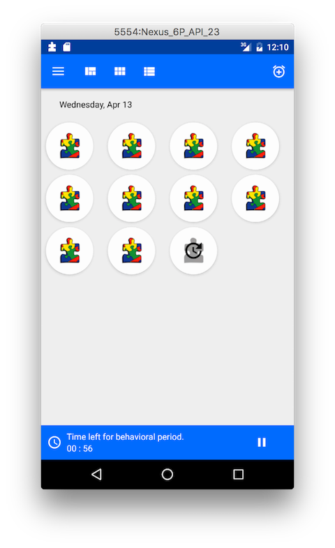
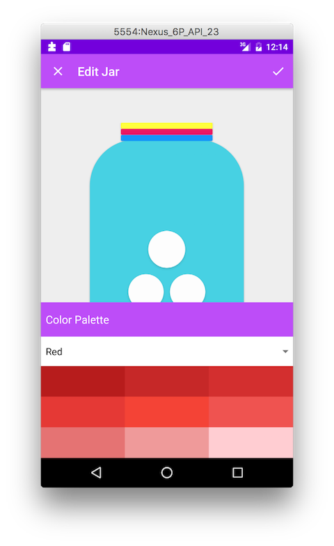

Jarble
========

Jarble is a new innovative way to use token boards*. 

The idea for Jarble was inspired by a little girl diagnosed with autism. Autism is a developmental disorder classified under the umbrella of Autism Spectrum Disorders, which can cause a delay in language skills, difficulties in verbal and nonverbal communication and impaired social interactions. Some who are diagnosed with autism may have intellectual disabilities, trouble with motor coordination and attention. 

Jarble was created to help monitor behavior and increase the desired behaviors by appealing to children’s creativity and work ethic. Jarble consists of a marble jar which functions as a token earning system, the marbles inside can be earned and colored in to show they have been earned. Instead of carrying around a token board, why not download it and conveniently carry it around on your phone or tablet instead? With the versatility of Jarble, you will be able to check-in with your child, student or client on their behavior and let them decorate the marbles they earned. This new creative token system engages its users to work hard to earn marbles in a variety of settings that include at home, in the community and even in school.

*A token economy is a system of reinforcers (rewards) used to increase a desired behavior while simultaneously decreasing the undesired behaviors. A token board is a visual representation of the token economy. In this case, the marble jar is the token board and the marbles inside represent a way to earn the reward. Using a token board is often found more encouraging for the child, student or client because they can see their progress towards the reward they are working for.

Video
==============

Screen Shots
==============

